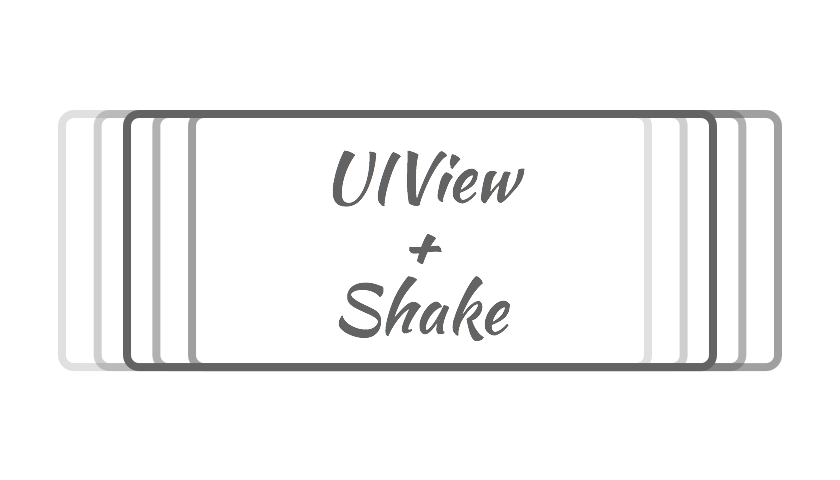

<p align="center">
  
</p>

[](https://travis-ci.org/andreamazz/UITextField-Shake)
[](http://cocoapods.org/?q=summary%3Auiview%20name%3Ashake%2A)
[](https://coveralls.io/r/andreamazz/UIView-Shake)

UIView category that adds a shake animation like the password field of the OSX login screen.

##Screenshot


##Setup with Cocoapods
* Add ```pod 'UIView+Shake'``` to your Podfile
* Run ```pod install```
* Run ```open App.xcworkspace```

###Objective-C
Import ```UIView+Shake.h``` in your controller's header file
###Swift
If you are using `use_frameworks!` in your Podfile, use this import:
```swift
import UIView_Shake
```
##Usage
```objc
// Shake with default values
[self.view shake];

// Shake with the default speed
[self.view shake:10   // 10 times
       withDelta:5    // 5 points wide
];

// Shake with a custom speed
[self.view shake:10   // 10 times
       withDelta:5    // 5 points wide
        andSpeed:0.03 // 30ms per shake
];

// Shake with a custom speed and direction
[self.view shake:10   // 10 times
       withDelta:5    // 5 points wide
        andSpeed:0.03 // 30ms per shake
  shakeDirection:ShakeDirectionVertical
];
```

#MIT License
	Copyright (c) 2015 Andrea Mazzini. All rights reserved.

	Permission is hereby granted, free of charge, to any person obtaining a
	copy of this software and associated documentation files (the "Software"),
	to deal in the Software without restriction, including
	without limitation the rights to use, copy, modify, merge, publish,
	distribute, sublicense, and/or sell copies of the Software, and to
	permit persons to whom the Software is furnished to do so, subject to
	the following conditions:

	The above copyright notice and this permission notice shall be included
	in all copies or substantial portions of the Software.

	THE SOFTWARE IS PROVIDED "AS IS", WITHOUT WARRANTY OF ANY KIND, EXPRESS
	OR IMPLIED, INCLUDING BUT NOT LIMITED TO THE WARRANTIES OF
	MERCHANTABILITY, FITNESS FOR A PARTICULAR PURPOSE AND NONINFRINGEMENT.
	IN NO EVENT SHALL THE AUTHORS OR COPYRIGHT HOLDERS BE LIABLE FOR ANY
	CLAIM, DAMAGES OR OTHER LIABILITY, WHETHER IN AN ACTION OF CONTRACT,
	TORT OR OTHERWISE, ARISING FROM, OUT OF OR IN CONNECTION WITH THE
	SOFTWARE OR THE USE OR OTHER DEALINGS IN THE SOFTWARE.
